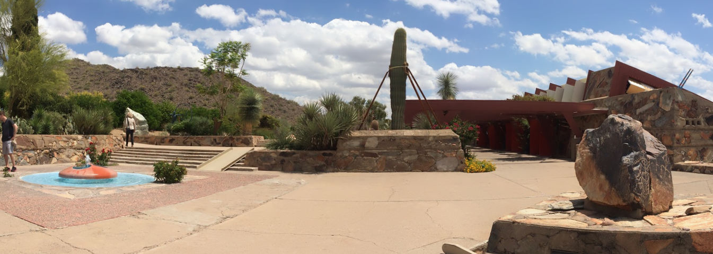

# Image Stitching with OpenCV


## Code
  __1. image_stitching_simple.py__:stitch images without croping the bounding black color

  __2. image_stitching.py__: stitch images with croping the bounding blacking color to create a rectangular


## How to run the program
  __1. image_stitching_simple.py__

    ```
    python image_stitching.py --images images/scottsdale --output output.png
    ```
  __OR__

    ```
    python image_stitching.py --images images/scottsdale --output output.png --crop 0
    ```
  
  __2. image_stitching.py__

    ```
    python image_stitching.py --images images/scottsdale --output output.png --crop 1
    ```

## Demo

