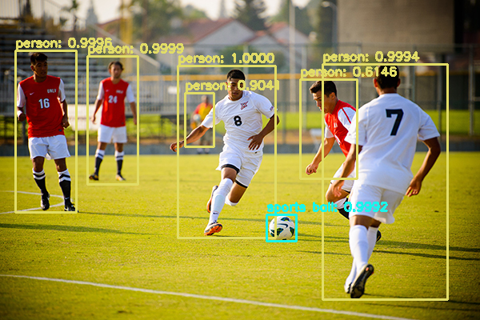

# Object Detection using YOLOv3

## Project structure

* __yolo-coco/__: the YOLOv3 object detector pre-trained (on the COCO dataset) model file, trained by [Darknet team](https://pjreddie.com/darknet/yolo/).
* __images/__: folder containing input images for testing and evaluation purposes
* __videos/__: folder containing input videos for testing and evaluation purposes
* __output/__: folder containing output images/videos processed by YOLO 

## How to run

1. __Step 1__: Preparation

Download __yolov3.cfg__ and __yolov3.weights__ from [Darknet](https://pjreddie.com/darknet/yolo/), put them under __yolo-coco/__.

2. __Step 2__: Run and evaluate the model

* Run YOLO object detection in videos

```
python yolo_realtime.py --input videos/car_chase_01.mp4 --output output/car_chase_01.avi --yolo yolo-coco
```

* Run YOLO object detection in images

```
python yolo.py --image images/soccer.jpg --yolo yolo-coco
```

## Demo 

