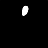

# Ultra-verve segmentation with UNET

## Dataset
This project use [Ultrasound Nerve Segmentation dataset](https://www.kaggle.com/c/ultrasound-nerve-segmentation) from Kaggle.

## Project structure

* __dataset/__
    - __test/__
    - __train/__

* data.py
* TrainUNET.py

## How to run

1. __Step 1__: Preparation

Download the dataset from Kaggle, then extract it to __dataset/__ folder under the root path of the project.

2. __Step 2__: Build the dataset

```
python data.py
```

3. __Step 3__: Predict and evaluate the model

```
python TrainUnet.py
```

## Demo 
 


